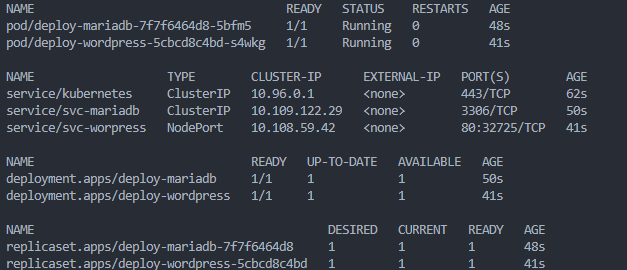
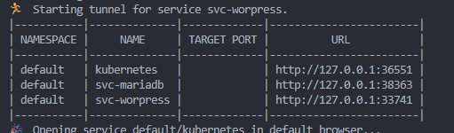

# Worpress K8S
> Deployment a mircoservices (Wordpress and MariaDB) on kubernetes
## description

This repo deploys an app with Wordpress and MariaDB with Persistent Volume on K8S, this is an academic exercise so I don't use security protocols for sensitive data.

## requirements
- minikube
- kubernets
- files [Deploy_mariadb.yaml](Deploy_mariadb.yaml) and [Deploy_wordpress.yaml](Deploy_wordpress.yaml)

## Step for compile

1. Clone this repository
2. Init minikube with this command `minikube start --ports=127.0.0.1:30080:30080`
3. Deploy mariadb with this command `kubectl apply -f Deploy_mariadb.yaml`
4. Deploy wordpress with this command `kubectl apply -f Deploy_wordpress.yaml`
5. Verify all with this command `kubectl get all` and obtain something similar to 
6. Verify port on minikube with this command `minikube service --all` and search some like this 